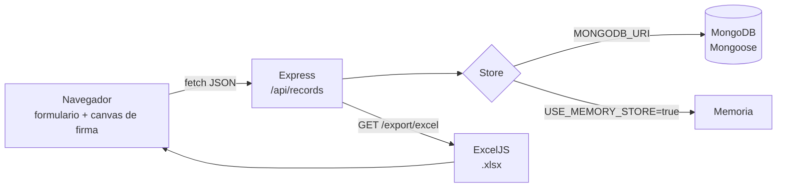

# Attendance Record Signature App

Aplicación web para registrar asistencia (fecha, nombre, horario, entrada, salida y motivo) con dos firmas dibujadas en pantalla y exportación del listado a Excel.

> Proyecto académico. **No tiene autenticación ni CORS restringido**: no debe exponerse a Internet ni usarse con datos reales sin aplicar antes las mejoras de la sección [Seguridad](#seguridad).

## Problema

Los partes de asistencia en papel (entrada, salida, motivo y firma de la persona y de supervisión) son difíciles de consultar, archivar y pasar a una hoja de cálculo.

## Solución

Un formulario web recoge los datos y las firmas mediante `<canvas>`, una API REST en Express los guarda en MongoDB y un endpoint genera un `.xlsx` con ExcelJS para entregar o archivar.

## Características

- Formulario con fecha, nombre, horario de inicio/fin, hora de entrada/salida, motivo y observaciones.
- Dos lienzos de firma (persona y supervisión) con ratón o pantalla táctil; las firmas se envían como `data:image/png;base64`.
- El frontend no permite guardar si falta alguna de las dos firmas.
- Tabla de registros guardados, ordenados por fecha descendente.
- Exportación a Excel (`registros-asistencia.xlsx`). La hoja indica si cada firma está incluida en la base de datos; **no incrusta la imagen de la firma**.
- Modo de almacenamiento en memoria para pruebas sin MongoDB.
- Endpoint de estado `/api/health`.

## Arquitectura



El controlador no accede a Mongoose directamente: recibe un *store* (`mongoStore` o `memoryStore`) con la misma interfaz (`listRecords`, `getRecord`, `createRecord`, `deleteRecord`), inyectado en `createApp()`. Esto permite ejecutar los tests sin base de datos.

## Stack

| Capa | Tecnología |
|------|------------|
| Backend | Node.js (ES modules), Express 4, Mongoose 8, morgan, cors, dotenv |
| Exportación | ExcelJS |
| Frontend | HTML, CSS y JavaScript sin framework, Canvas API |
| Base de datos | MongoDB |
| Tests | `node:test` + supertest |

## Instalación

Requisitos: Node.js 18.11 o superior (usa `node --test` y `node --watch`) y, opcionalmente, MongoDB.

```bash
npm ci
cp .env.example .env
npm start          # o: npm run dev (recarga con --watch)
```

Abre `http://localhost:3000`.

## Configuración

Variables leídas desde `.env` (ver `.env.example`; `.env` está en `.gitignore`):

| Variable | Descripción | Por defecto |
|----------|-------------|-------------|
| `PORT` | Puerto HTTP | `3000` |
| `MONGODB_URI` | Cadena de conexión a MongoDB | — |
| `USE_MEMORY_STORE` | `true` para guardar en memoria (se pierde al reiniciar) | — |

Si `MONGODB_URI` no está definida, la aplicación arranca **en modo memoria** aunque `USE_MEMORY_STORE` no sea `true`.

Prueba rápida sin MongoDB:

```bash
USE_MEMORY_STORE=true npm start
```

## Uso

### API

| Método | Ruta | Descripción |
|--------|------|-------------|
| `GET` | `/api/health` | Estado y tipo de almacenamiento |
| `GET` | `/api/records` | Lista de registros (incluye las firmas en base64) |
| `GET` | `/api/records/:id` | Un registro |
| `POST` | `/api/records` | Crea un registro |
| `DELETE` | `/api/records/:id` | Elimina un registro (solo API; la interfaz no tiene botón de borrado) |
| `GET` | `/api/records/export/excel` | Descarga `registros-asistencia.xlsx` |

El frontend estático se sirve desde `public/` en `/`.

Ejemplo de cuerpo para `POST /api/records` (todos los campos son obligatorios salvo `observations`):

```json
{
  "date": "2026-06-27",
  "fullName": "Nombre Apellido",
  "scheduleStart": "08:00",
  "scheduleEnd": "15:00",
  "entryTime": "08:03",
  "exitTime": "15:01",
  "reason": "Jornada ordinaria",
  "observations": "Sin incidencias",
  "employeeSignature": "data:image/png;base64,...",
  "supervisorSignature": "data:image/png;base64,..."
}
```

Respuestas con el formato `{ "success": true|false, "data" | "message": ... }`.

```bash
curl -L http://localhost:3000/api/records/export/excel -o registros-asistencia.xlsx
```

### Tests

```bash
npm test        # 4 tests: health, alta + listado, campos obligatorios, exportación Excel
npm run lint    # node --check
```

Los tests usan el store en memoria; no necesitan MongoDB.

## Estructura

```text
public/                 Frontend estático (index.html, styles.css, app.js)
src/
  server.js             Arranque: elige MongoDB o memoria
  app.js                Configuración de Express y middlewares
  config/database.js    Conexión a MongoDB
  controllers/          Lógica de los endpoints y exportación Excel
  middleware/           404 y gestor de errores
  models/               Esquema Mongoose del registro
  repositories/         mongoStore y memoryStore (misma interfaz)
  routes/               Rutas /api/records
tests/records.test.js   Tests de la API con supertest
```

## Seguridad

Estado actual, verificado en el código:

- **Sin autenticación ni autorización.** Cualquiera con acceso a la red puede listar, crear, eliminar registros y descargar el Excel.
- **CORS abierto.** `app.use(cors())` responde `Access-Control-Allow-Origin: *` a cualquier origen.
- **Validación mínima.** El controlador solo comprueba que los campos obligatorios no estén vacíos; Mongoose aplica `required` y `trim`. No se valida el formato de fecha/hora, la longitud de los textos ni que las firmas sean realmente imágenes PNG. En modo memoria se guarda el cuerpo tal cual, incluidos campos extra.
- **XSS almacenado corregido.** La tabla insertaba `fullName`, `reason`, `observations`, etc. con `innerHTML` sin escapar. Ahora `public/app.js` construye cada celda con `textContent`: un registro con `` o `<script>` se muestra como texto y no se ejecuta (comprobado en el navegador).
- **Cuerpo de hasta 10 MB** (`express.json({ limit: '10mb' })`) y **sin rate limiting**.
- **Mensajes de error internos** devueltos al cliente en errores 500 (p. ej. un `id` con formato inválido en MongoDB).
- **Datos personales.** Nombre, horarios y firma manuscrita son datos personales (RGPD); la firma se guarda en claro en MongoDB y `GET /api/records` la devuelve completa.

Mejoras pendientes:

1. Autenticación (sesión o JWT) y roles (persona / supervisión / administración), especialmente para borrar y exportar.
2. CORS restringido al origen del frontend (o desactivado si se sirve desde el mismo origen).
3. Rate limiting (p. ej. `express-rate-limit`) y un límite de cuerpo ajustado al tamaño real de una firma.
4. Validación de entrada con esquema (formato `YYYY-MM-DD` y `HH:MM`, longitudes máximas, firma `data:image/png;base64` con tamaño acotado) y lista blanca de campos.
5. Cabeceras de seguridad (`helmet`) y una Content Security Policy como segunda barrera frente a XSS.
6. Protección de datos (RGPD): base legal e información al interesado, minimización (no devolver firmas en el listado), cifrado en tránsito (HTTPS) y en reposo, política de conservación y borrado, y registro de accesos.
7. Ocultar detalles internos en los errores 500 y validar `ObjectId` antes de consultar.

## Estado

Prototipo funcional de aprendizaje. Los 4 tests pasan. `npm audit` informa de 2 vulnerabilidades moderadas en `uuid` (dependencia de ExcelJS) cuya única corrección disponible implica bajar ExcelJS a una versión incompatible. No hay despliegue ni CI configurados.

## Aprendizajes

- Separar el acceso a datos en *stores* intercambiables para probar la API sin base de datos.
- Capturar firmas con Canvas (ratón y táctil) y enviarlas como Data URL.
- Generar y enviar un `.xlsx` en streaming con ExcelJS.
- Tests de integración HTTP con `node:test` y supertest.
- Que una aplicación "que funciona" no es desplegable si trata datos personales sin autenticación, validación ni control de acceso.

## Licencia

[MIT](LICENSE) © 2026 Nauzet Doreste
